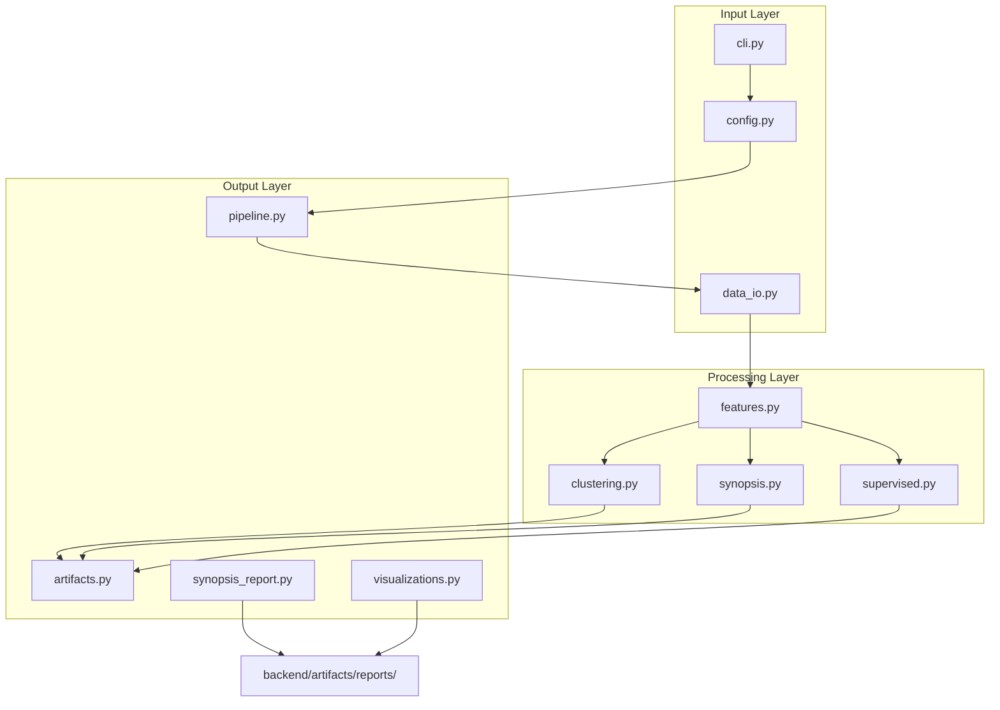

# Architecture

## Overview

The FDIC ML pipeline is a modular, config-driven system organized into a single Python package under `backend/src/`.

## Module Reference

### `data_io.py` — Data Ingestion

- `load_and_merge_csvs(input_dir)` — reads all CSVs, merges on `CERT` index
- `validate_required_columns(df, columns)` — fails fast on missing source columns

### `features.py` — Feature Engineering

- `engineer_fdic_features(df)` — computes four risk ratios, median-imputes NaN
- `remove_outliers_by_quantile(features, low, high)` — row-level quantile filtering

### `clustering.py` — Unsupervised Segmentation

- `train_clustering(features, max_clusters, seed)` — KMeans with silhouette-based k selection
- Relabels clusters by average `Capital_Ratio` for interpretability
- Reports corroborating quality metrics: Calinski-Harabasz, Davies-Bouldin, bootstrap stability (ARI)

### `synopsis.py` — Multi-Method Diagnostics

- `build_data_synopsis(features, seed)` — runs PCA, IsolationForest, a four-way clustering comparison (KMeans, Agglomerative, Gaussian Mixture, HDBSCAN), and correlation mining
- Returns metrics dict + component/anomaly/correlation DataFrames

### `labels.py` — Constructed Target

- `build_stress_label(features, quantile)` — transparent proxy label (top-decile asset-quality stress) when the dataset ships no target; returns the label and the feature that defines it

### `supervised.py` — Interpretable Classification

- `train_supervised(features, labels, seed)` — compares logistic (L2, elastic net) and shallow decision tree
- Selects best model by ROC AUC (binary) or weighted F1
- Adds cross-validated scores (mean/std) and model-agnostic permutation importance
- Extracts feature explanations (coefficients or importances)

### `pipeline.py` — Orchestrator

- `run_pipeline(config)` — end-to-end execution based on mode:
  - `clustering` — feature engineering + KMeans
  - `synopsis` — feature engineering + multi-method diagnostics
  - `supervised` — feature engineering + model comparison (requires label)
  - `both` — all three tracks

### `risk_score.py` — Composite Risk Ranking

- `compute_risk_scores(features_df, top_n)` — orients every CAMELS feature toward risk (z-score × direction), averages into one score, ranks all institutions, and returns a top-N watchlist
- Runs in every pipeline mode (feature-only); emits `risk_scores.csv` + `risk_watchlist.csv`

### `temporal.py` — Time-Series Tracking

- `generate_trend_report(output_dir, quarters, figures_dir)` — pulls past filings from the public FDIC BankFind API and tracks CAMELS ratio trends
- `fetch_quarter(...)` (network, cached) is separated from `summarize_trends(...)` (pure, unit-tested)
- Outputs a per-quarter median/IQR summary CSV and a small-multiples trend figure

### `synopsis_report.py` — Report Generation

- `generate_synopsis_report(output_dir, reports_dir, run_dir)` — reads synopsis artifacts, writes markdown narrative

### `visualizations.py` — Visualization Generation

- `generate_visualizations(output_dir, report_dir, figures_dir, run_dir)` — creates matplotlib charts and markdown report
- Outputs figures under `backend/artifacts/reports/secondary/figures/`

### `artifacts.py` — Output Management

- `create_run_dir(output_dir, mode)` — timestamped run directories
- `write_json()`, `write_frame()` — artifact writers

## Artifact Contract

Each run creates `backend/artifacts/<timestamp>_<mode>/`:

| File | Mode | Contents |
|------|------|----------|
| `config.json` | all | Run configuration + row counts |
| `risk_scores.csv` | all | Composite risk score + rank per institution |
| `risk_watchlist.csv` | all | Top-N riskiest institutions |
| `clustered_features.csv` | clustering | Features + cluster labels |
| `cluster_summary.csv` | clustering | Mean profile per cluster |
| `clustering_metrics.json` | clustering | best_k, silhouette_score |
| `synopsis_metrics.json` | synopsis | PCA variance, anomaly share, silhouettes |
| `synopsis_pca_components.csv` | synopsis | PC scores per institution |
| `synopsis_anomalies.csv` | synopsis | Anomaly flags + scores |
| `synopsis_correlations.csv` | synopsis | Top feature correlation pairs |
| `supervised_predictions.csv` | supervised | y_true, y_pred, y_score |
| `supervised_metrics.json` | supervised | Selected model, label source, hold-out + CV metrics |
| `supervised_feature_explanations.csv` | supervised | Native coefficient/tree weights |
| `supervised_permutation_importance.csv` | supervised | Model-agnostic permutation importance |

## Report Tiering

| Tier | Location | Purpose |
|------|----------|---------|
| Primary | `backend/artifacts/reports/primary/` | Locally generated summary reports |
| Secondary | `backend/artifacts/reports/secondary/` | Locally generated diagnostics + visualizations |

## Configuration

Runs are driven by JSON config files in `backend/configs/`:

- `local.example.json` — template for full local data at `data/raw/fdic/`

Key parameters: `input_dir`, `output_dir`, `mode`, `max_clusters`, `outlier_quantile_low/high`, `label_column`.

## Known Design Decisions

- **Local-first**: no cloud dependencies for the core analysis; all artifacts written to disk (the optional time-series module pulls from the FDIC API)
- **Interpretable models only**: no black-box ensembles in supervised track
- **Shared feature path**: clustering, synopsis, and supervised all use the same engineered features
- **Quantile outlier removal**: any feature outside percentile bounds drops the entire row
