# FDIC Risk Assessment: 2025 Balance-Sheet Risk Across Bank Sizes
Authors:
### Tharun Sankar – Data Science, Computer Science third-year at University of California, Davis
### Philip Rybkin – Managerial Economics, Statistics third-year at University of California, Davis

## Project Overview
A top-down risk assessment of the U.S. banking sector using September 2025 FDIC Call Report data. We merged six Call Report tables with supplemental fields from the FDIC BankFind API, reduced each of the 4,388 FDIC-insured institutions to a set of comparable financial ratios, and used unsupervised machine learning plus asset-size segmentation to find where specific risks concentrate. The headline result is that balance-sheet risk is not spread evenly by size: interest-rate exposure through large securities books sits with the biggest banks, while commercial real estate concentration is the defining exposure of the mid-cap tier ($10B to $50B).

## Motivation
Banks entered 2025 after two years of high interest rates, which lowered the market value of long-dated bonds and raised deposit costs. The open question was where that pressure actually lands across bank sizes, and whether the mid-sized regionals that drew attention in 2023 look different from the giants and from small community banks. Instead of assuming the answer, we let the reported numbers place the risk. They pointed somewhere specific: the securities and rate exposure often pinned on mid-caps is heavier at the largest banks, and the real mid-cap concentration is in commercial real estate.

## Technical Pipeline

### 1. Data Engineering (ETL)
- **Multi-Source Merge:** Joined six FDIC Call Report schedules on the Certificate Number (CERT): Total Assets, Total Liabilities & Capital, Interest Income, Interest Expense, Past-Due & Nonaccrual Assets, and Net Charge-Offs. Pulled supplemental fields (HTM and AFS securities, Tier 1 Capital, Net Interest Margin, Efficiency Ratio, Nonperforming Assets, and CRE loan lines) from the FDIC BankFind API.
- **Schema Standardization:** Resolved duplicate column names and CERT join conflicts to keep one traceable master table for 4,388 institutions, all pinned to the September 30, 2025 reporting date.
- **Feature Engineering:** Derived four core ratios (Capital Ratio, Net Interest Margin, Texas Ratio, Charge-Off Ratio) plus three large-bank exposure metrics (Securities-to-Tier 1, HTM Share of Securities, and CRE-to-Tier 1).
- **Industry Ratio Panel:** Pulled the FDIC Performance & Condition ratios for all 4,388 banks and computed medians across every size tier: earnings (ROA, ROE, Net Interest Margin, Efficiency Ratio), capital (Total Risk-Based Capital, Tier 1 Leverage), asset quality (Noncurrent Loans, Net Charge-Offs, Nonperforming Assets), and liquidity (Loans-to-Deposits, Deposits-to-Assets).

### 2. Unsupervised Machine Learning
- **Feature Scaling:** Applied StandardScaler so ratios on different magnitudes (fractions vs. percentages) contribute evenly to distance calculations.
- **K-Means Clustering:** Ran K-Means twice, once on the four core ratios and once on the full 15-ratio CAMELS panel, choosing the number of groups by silhouette score across k = 2 to 8.
- **Two Results, One Lesson:** The four-ratio run lands on k = 2 (silhouette 0.83), which looks decisive but is really one 4,121-bank group plus a 23-bank tail. The 15-ratio run lands on k = 5 (silhouette 0.16), five softer and overlapping but interpretable groups. The richer feature set traded a tidy illusion for a more honest, more complex picture. The Unsupervised Segmentation section below shows both.

### 3. Size-Tier Segmentation
- **Asset Buckets:** Grouped every bank into mega (over $250B), large regional ($50B to $250B), mid-cap ($10B to $50B), community ($1B to $10B), and small (under $1B).
- **Cross-Tier Comparison:** Compared median exposure metrics across tiers, which is where the real structure appears.

## Key Insights

- **Risk Is Stratified by Size:** The population breaks into 12 mega banks, 38 large regionals, 107 mid-caps, 900 community banks, and 3,331 small institutions. The 50 largest banks hold roughly three-quarters of all system assets (about $19T of $25T).

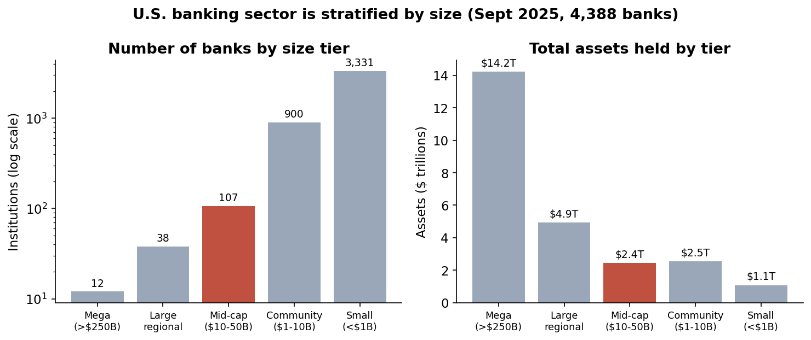

- **Earnings Follow a Margin-vs-Efficiency Gradient:** Net interest margin widens steadily as banks get smaller (2.94% at the mega banks to 3.75% at small banks), but the efficiency ratio worsens in step (55% to 65%, where lower is better). The two effects cancel, so return on assets holds near 1.1% at every tier. Smaller banks earn fatter spreads and spend more to earn each dollar.

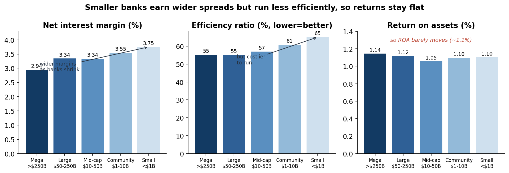

- **Credit Costs Concentrate at the Largest Banks:** Net charge-offs run 0.52% of loans at the mega banks against 0.01% at small banks, and noncurrent loans follow the same gradient (0.87% versus 0.38%). The credit losses in the system sit mostly in the large consumer and card books, not in the community banks.

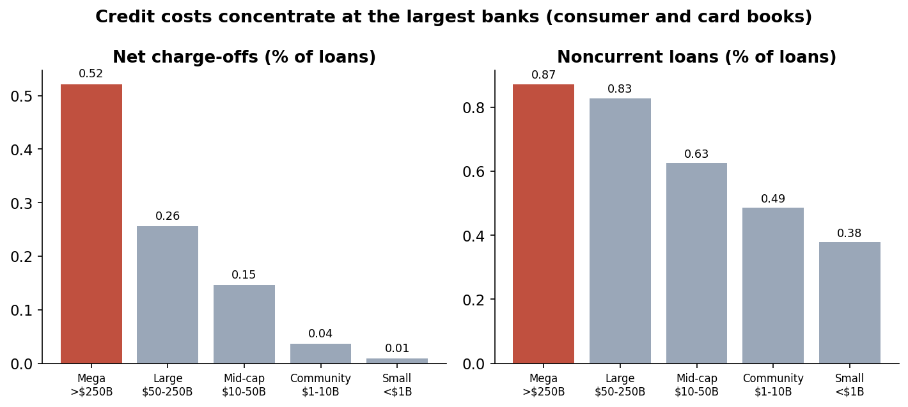

- **Rate Exposure Sits with the Giants:** Securities relative to Tier 1 capital are highest at the mega banks (median 2.77) and lowest at the mid-caps (1.71). The held-to-maturity share of the securities book is 41% at the mega banks against 15% at the mid-caps, so the large, rate-sensitive bond books are a big-bank feature.

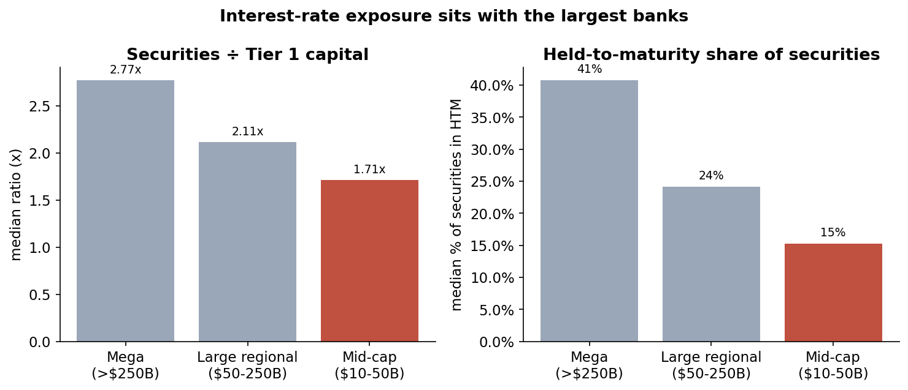

- **Commercial Real Estate Is the Mid-Cap Story:** CRE relative to Tier 1 capital runs 2.24 at the median mid-cap versus 0.29 at the mega banks, about 7.7 times higher. Roughly 37% of mid-caps carry CRE above three times Tier 1 capital, a level that draws supervisory attention, against 5% of regionals.

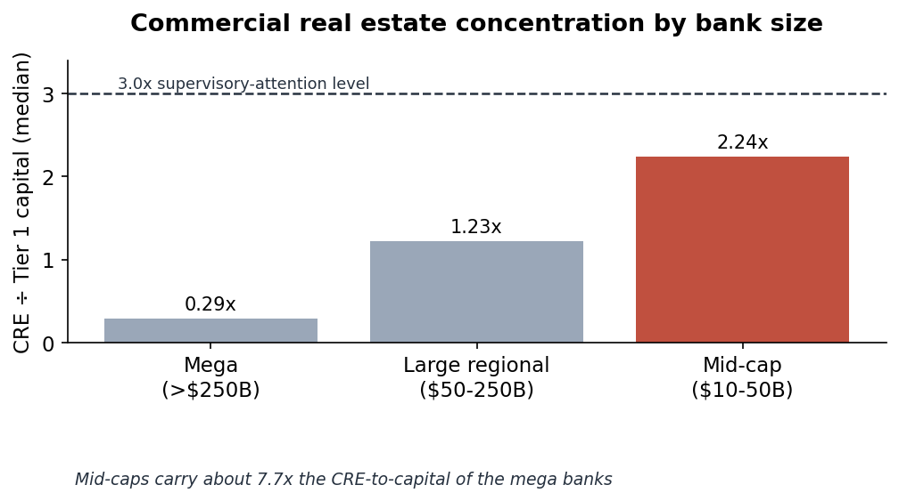

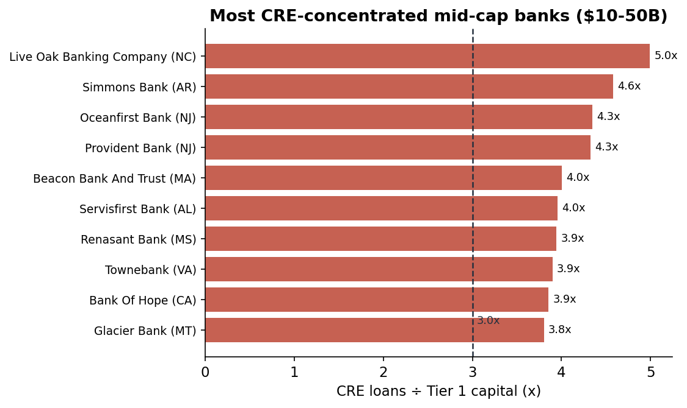

- **Profitability Does Not Flag the Mid-Caps:** Mid-caps run a slightly higher Net Interest Margin (median 3.36) than the mega banks (2.94), so a size-blind earnings screen would miss the concentration entirely. This is a concentration risk, not a current-earnings problem.

## Unsupervised Segmentation
Beyond the size tiers, we let K-Means group banks purely on their financial ratios, with no size or geography given to the model. Running it on two different feature sets shows both what unsupervised learning can find and where it runs out of road.

- **The two-cluster result (four ratios):** On the four core ratios, K-Means picks two clusters with a high silhouette of 0.83. The split looks decisive, but it is really one dominant group of 4,121 banks and a 23-bank outlier tail. With so few features, a single extreme tail drives the whole separation, so the clean score is misleading.
- **The five-cluster result (15 ratios):** On the full CAMELS panel, K-Means picks five clusters with a much lower silhouette of 0.16. The score is lower because the groups overlap, yet the five are financially coherent: an asset-quality-stressed group (about 501 banks), a high-performer group (about 1,495), an over-capitalized conservative group (about 311), a thin-margin core (about 1,612), and a small idiosyncratic tail (about 22).

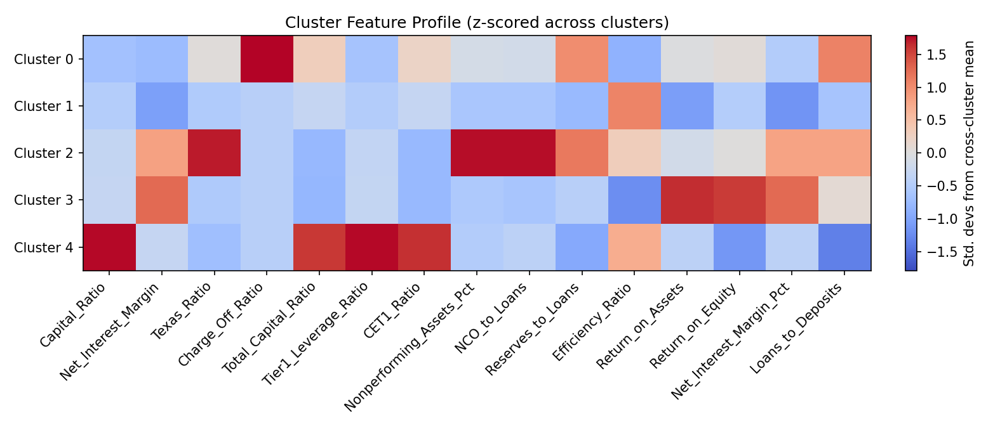

Each row above is one of the five clusters and each column is a ratio, colored red where a cluster scores high and blue where it scores low relative to the others. The stressed cluster lights up across Texas Ratio, nonperforming assets, and net charge-offs; the high performers own return on assets and equity; the conservatives dominate every capital column. The groups are not arbitrary, each has a clear financial persona.

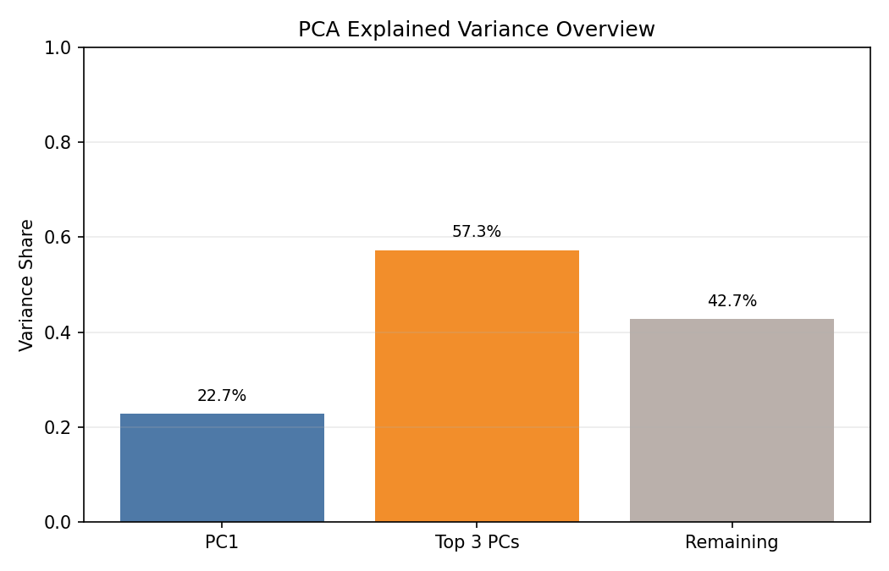

Principal Component Analysis explains why the five-cluster silhouette is low. Compressing the 15 ratios, the first component accounts for only 22.7% of the variation and the top three together for 57.3%. No single factor captures bank health, so the banks form a continuous, many-directional cloud rather than a few separated islands.

**What the clustering cannot fully show.** This is where the method's limits matter, and stating them is part of the analysis:
- **A clean result can be an artifact.** The 0.83 two-cluster score came from having too few features. Adding real signal lowered the score and raised the honesty. A high silhouette is not proof of real structure.
- **The groups are personas, not hard boundaries.** A silhouette of 0.16 and a flat PCA say the same thing: real structure with soft, overlapping edges. Bootstrap resampling recovers roughly the same five groups (adjusted Rand index about 0.64), so they are stable enough to name but not sharp enough to draw firm lines between.
- **It is descriptive, not predictive.** Clustering says which group a bank resembles today. It does not forecast which banks will deteriorate, and it assigns no probability of stress. That would need a labeled, forward-looking model.

## Geographic Interpretation
Bank profitability is not uniform across the country. Grouping all 4,388 banks by home state and taking the median return on assets (for states with at least five banks) reveals a clear regional gradient: the Sunbelt and Mountain West lead, and the Northeast corridor lags.

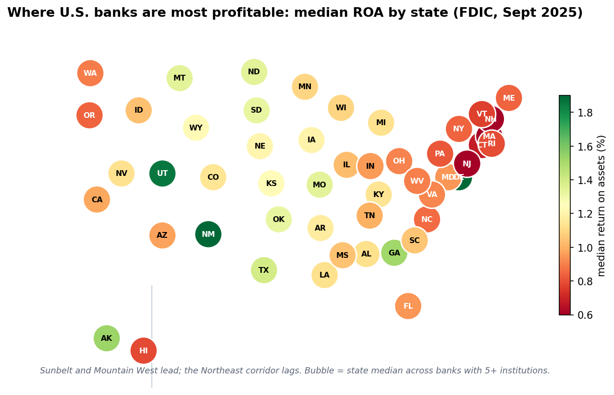

The top states by median ROA are New Mexico (1.90%), Utah (1.86%), Georgia (1.52%), Texas (1.39%), and Montana (1.35%). The lowest are Massachusetts (0.52%), New Jersey (0.53%), Connecticut (0.68%), Pennsylvania (0.82%), and New York (0.84%). Net interest margin tracks the same map, from about 5.6% in Utah to 2.8% in Massachusetts, so the gap comes from where banks can lend at wider spreads rather than from cost control alone.

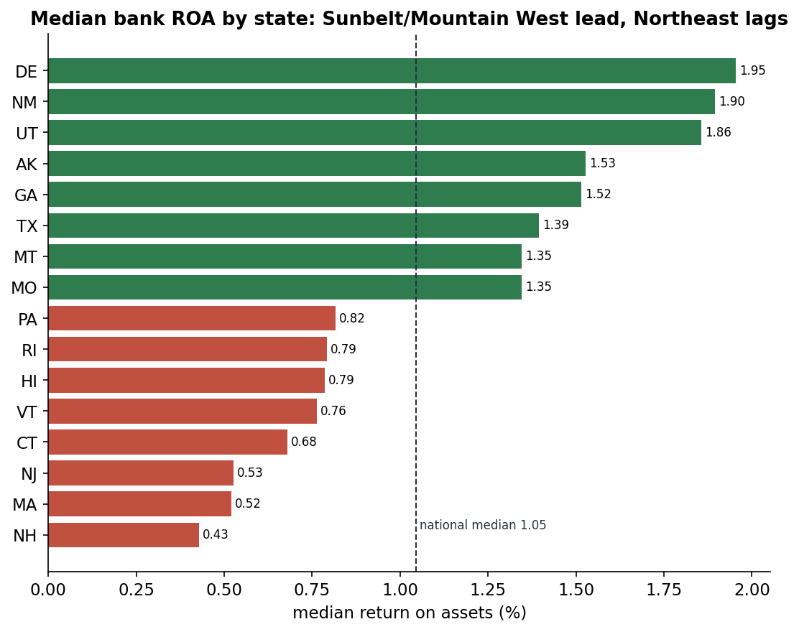

**How This Was Built:** group the full institution table by state (the `STALP` field), take the median of each ratio within each state, keep only states with at least five banks so a single institution cannot swing the result, then plot every state at its geographic centroid, colored by median ROA. An earlier view from the CRE analysis showed a different geographic angle, the states where the most CRE-concentrated large banks are headquartered: New Jersey, California, Florida, Arkansas, Pennsylvania, and Missouri.

## Trends Over Time
The snapshot shows where risk sits today. Pulling the same ratios for the last eight quarters (Q4 2023 through Q3 2025) shows where it is heading.

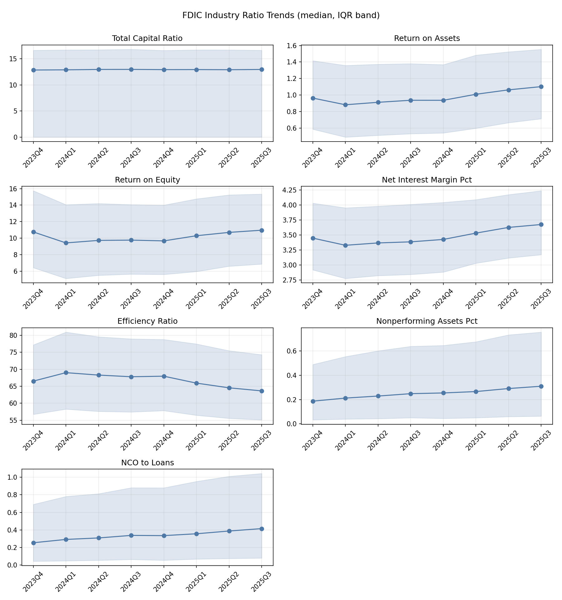

Capital held flat while earnings recovered: median return on assets rose from 0.96 to 1.10 and net interest margin from 3.45 to 3.68, both off an early-2024 trough, and the efficiency ratio improved. Underneath that recovery, credit quality softened. Nonperforming assets rose about 63% and net charge-offs about 64%, from low starting levels. The income statement looks healthier than a year earlier while the balance sheet quietly takes on more credit risk. That divergence, more than any single quarter's number, is the thing to watch.

## Scope and Limitations
- **Snapshot, Not Forecast:** Every figure is measured at one reporting date. It describes current exposure and concentration, not predicted failures.
- **Exposure, Not Losses:** The securities metrics measure balance-sheet composition (book size relative to capital, and held-to-maturity share). The public aggregated data does not report mark-to-market gains or losses, so we do not estimate them.
- **Concentration Is a Flag, Not a Verdict:** A CRE-concentrated bank is one a supervisor watches more closely, not one that is failing.

## Technologies
- **Language:** Python
- **Data:** Pandas, NumPy
- **Machine Learning:** Scikit-learn (K-Means, StandardScaler, silhouette analysis, PCA, Isolation Forest)
- **Visualization:** Matplotlib
- **Data Sources:** FDIC Call Report bulk files, FDIC BankFind API
