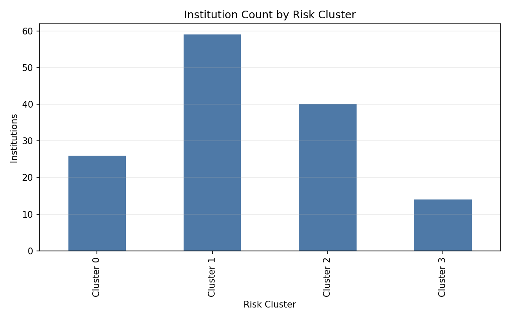
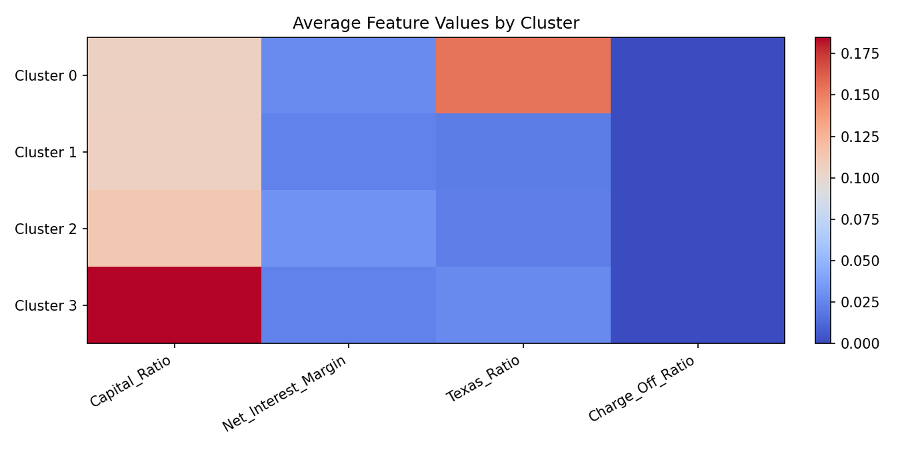
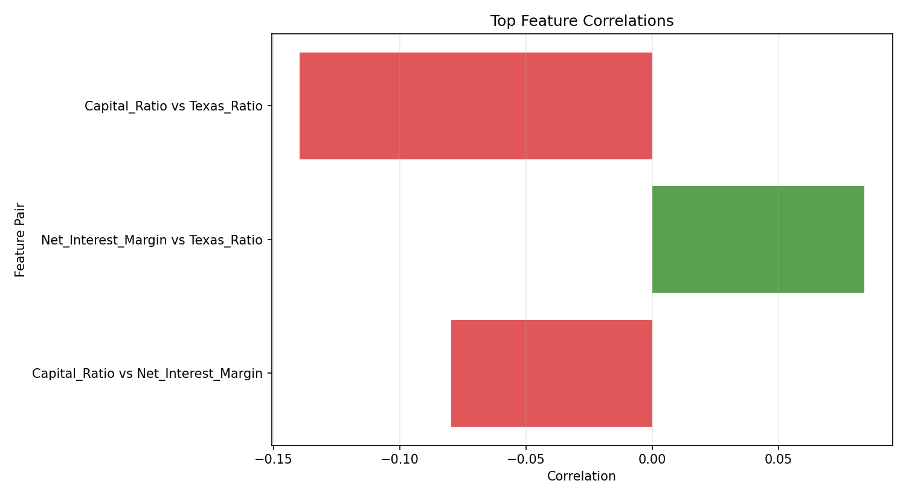
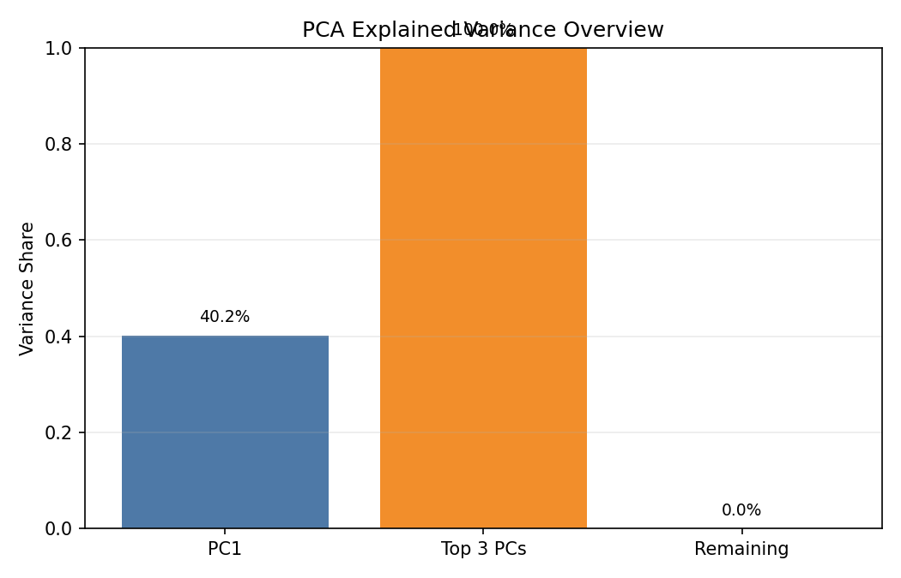
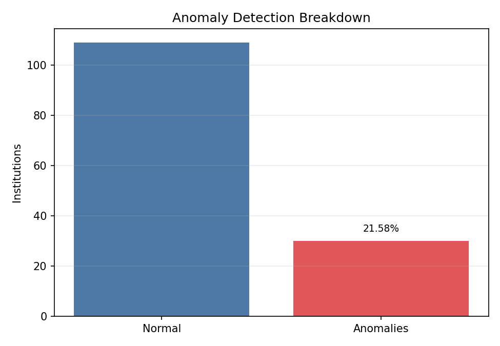

# Visualization Report

## Run Source
- `backend/artifacts/20260527T174229Z_both`

## Generated Figures
### Cluster Size

### Cluster Feature Means

### Top Correlations

### Pca Variance Overview

### Anomaly Breakdown

## Skipped Charts
- None
